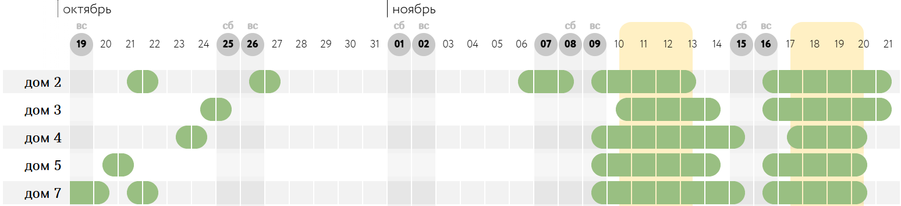

# Availability Calendar Widget
📘 **Languages:**  
[🇷🇺 Русский](README.md) | [🇬🇧 English](README.en.md) | [🇵🇱 Polski](README.pl.md)



*An interactive availability calendar for booking houses on luga.by*

An interactive widget for displaying house/room availability on a website. It integrates with Google Sheets, Google Apps Script, and WuBook/Zak API (a PMS for hotels). It shows dates, status (available/occupied), and allows selecting booking date ranges.

## Features 🚀

- Dynamic availability table with visual indicators.
- Holiday and weekend detection (Nager.Date API).
- Interactive check-in/check-out date selection with validation.
- Custom styling for special periods.
- Data caching (Google CacheService, Drive).
- API integration (implemented for WuBook/Zak).
- Responsive design (CSS, horizontal scroll).
- Test mode with predefined data.

## Demo 📺

- **Live Demo**: [example.html](https://htosci.github.io/availibl_widget/example.html).

## Requirements 🛠️

- Google Account (Apps Script, Sheets).
- API Keys: Nager.Date (free), WuBook/Zak.

## Setup 📋

### 1. Google Sheets
1. Create a spreadsheet, name the sheet `available`.
2. Structure:
   - Row 2: Dates for display (from column C, `DD.MM.YYYY`).
   - Column A: House IDs in ZakAPI (from row 3).
   - Column B: House names.
   - Rest: `TRUE`/`FALSE` (filled by script).
3. Save `SPREADSHEET_ID` (from URL).

### 2. Google Apps Script
1. Create a project in [Apps Script](https://script.google.com).
2. Copy files: `Avail_vidget.js`, `json_creator.js`, `json_creator_utility.js`, `zag_to_table.js`, `zag_to_table_utility.js`, `utility.js`, `test_data_json.js`, `style.html` (rename from .css).
3. Set `SPREADSHEET_ID` and `ZAG_API_KEY` in PropertiesService.
4. Deploy as Web App: `Deploy > Web app > Execute as: Me > Access: Anyone`.
5. Copy `APP_SCRIPT_URL`.

### 3. Frontend
1. Copy: `script_to_site.js`.
2. Add to HTML:
   ```html
   <div id="appscript-widget-container"></div>
   <script src="script_to_site.js"></script>
   ```
3. Set `APP_SCRIPT_URL` in `script_to_site.js`.

### 4. Testing
- Run `UpdateTableFromZAG()` in Apps Script.
- Run `updateCacheAndFile()` in utility.
- Open `your.html`.

### 5. Automation
- Trigger in Apps Script: `Triggers > Add Trigger > UpdateTableFromZAG > Hourly`.

## Usage 🔧

- Widget loads in `<div id="appscript-widget-container">`.
- Date selection: Click the first and last date → range saved in `selectedRange`.
- Update: `updateCacheAndFile()` (manually or via trigger).
- Customization: Edit `style.css` or `script_to_site.js`.

## Debugging ⚠️

- **API Errors**: Check keys and limits.
- **Cache**: Clear with `clearHolidayCache()`.
- **Time Zone**: Use `Europe/Minsk` in formatters.
- **Logs**: Check via `Logger.log()`.

## License 📄

MIT License.

## Author 👨‍💻

## Author
Developed as part of the [luga.by](https://luga.by) project.  
Architecture, logic, and design by @htosci.